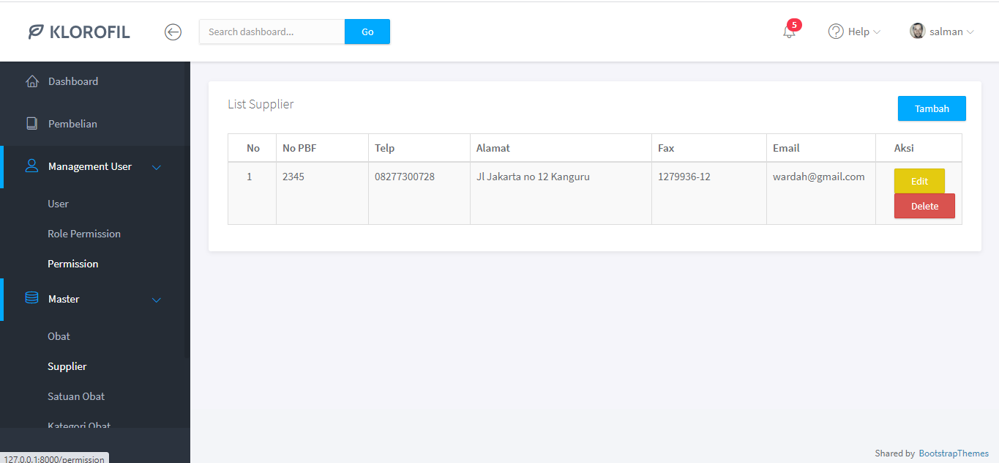

# Sistem Informasi Inventory Apotik

Apotek adalah sarana pelayanan keafarmasian yang tempat dilakukan praktik kefarmasian oleh apoteker selain sebagai tempat pelayanan kefarmasian apotek juga sebagai tempat penyaluran sediaan farmasi dan pembekalan kesehatan kepada masyarakat.

Sistem informasi inventory apotik dapat mempermudah kontrol stock barang, monitoring kadaluarsa barang, dan sistem penjualan sehingga laporan bisa direkap secara digital sehingga efektif dan efisien.

Sistem informasi inven apotik pernah dibuat pada platform desktop. Tujuan dari pembuatan platform web  agar sistem tersebut mempunyai ruang lingkupnya akses lebih luas. Proyek sistem ini bersifat open source dan siapa saja dapat mengunduh source code.

### Dokumentasi Sistem

Dokumentasi dari sistem menggunakan model UML karena awal dari pembuatan projek ini menggunakan konsep berorientasi object. Diagram lainnya dapat di lihat pada folder [disini](https://github.com/FarisLucky/inventory-apotik-web/tree/main/Activity)
### List Fitur Sistem
```
1. Login
2. Management User And Role
3. Data Master
   a. Obat
   b. Supplier
   c. Satuan Obat
   d. Kategori Obat
4. Pembelian (Belum Selesai)
5. Laporan Bulanan (Belum Selesai)
```
## Informasi Terakhir
Sistem ini belum sepenuh nya selesai karena saat pembuatan sistem ini, saya juga sedang menyelesaikan skripsi dan saya _memutuskan untuk **menghentikan**_ pengembangan pada sistem ini.


